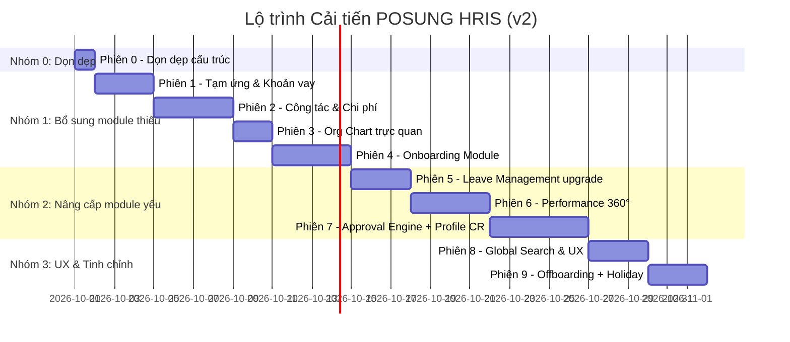

# 📊 PHÂN TÍCH SO SÁNH CHUYÊN SÂU: POSUNG HRIS vs QLNL_MẪU (Saigon Technology HRM)

> [!NOTE]
> **QLNL_Mẫu** là hệ thống quản trị nhân lực enterprise-grade xây dựng cho Saigon Technology (NestJS + Next.js + PostgreSQL + Docker). Hệ thống bao phủ **47 Use Cases**, **87 model Prisma**, kiến trúc 3 tầng với tài liệu PTTK hoàn chỉnh (biểu đồ UML, class diagram, sequence diagram). Đây là chuẩn đối sánh cấp doanh nghiệp lớn.

---

## 1. BẢNG SO SÁNH TỔNG QUAN MODULE

| # | Phân hệ / Module | POSUNG HRIS | QLNL_Mẫu | Đánh giá |
|:---:|---|:---:|:---:|:---:|
| 1 | Quản trị hệ thống (User, Role, RBAC) | ✅ 4 Controller | ✅ RBAC đa cấp + row-level | **🟡 POSUNG yếu hơn** |
| 2 | Cơ cấu tổ chức (Org Chart, Phòng ban) | ✅ OrganizationController | ✅ Org-Units + Tree view | **Tương đương** |
| 3 | Hồ sơ nhân sự 360° | ✅ **929 dòng** (rất mạnh) | ✅ Personnel Profile (32K module) | **Tương đương** |
| 4 | Hợp đồng lao động | ✅ ContractController | ✅ UC10 + Phụ lục HĐ | **🟡 POSUNG thiếu phụ lục HĐ** |
| 5 | Tuyển dụng & ATS | ✅ RecruitmentController (464 dòng) | ✅ UC04-08 (Pipeline đầy đủ) | **🟡 QLNL có Interview + Offer riêng** |
| 6 | Onboarding / Hội nhập | ⚠️ Chỉ trong Recruitment | ✅ UC14 - Module riêng (14K) | **🔴 POSUNG THIẾU** |
| 7 | Chấm công (Timesheet) | ✅ TimesheetController + IoT | ✅ UC18-25 (đa nguồn, QR, face) | **POSUNG tương đương** |
| 8 | Ca kíp (Shift Management) | ⚠️ Sơ khai trong Shift model | ✅ UC23 - Module riêng | **🟡 CẦN NÂNG CẤP** |
| 9 | Nghỉ phép (Leave) | ✅ LeaveController | ✅ UC21 (Leave Allocation chuẩn Frappe) | **🟡 POSUNG đơn giản hơn** |
| 10 | Tăng ca (Overtime) | ⚠️ Trong Timesheet | ✅ UC22 - Module riêng | **🟡 POSUNG gộp chung** |
| 11 | Tính lương (Payroll) | ✅ PayrollController + Formula | ✅ UC26-28 + Components cấu hình | **Tương đương** |
| 12 | Phụ cấp (Allowance) | ✅ EmployeeAllowanceController | ⚠️ Trong Payroll Components | **POSUNG tốt hơn** |
| 13 | Khen thưởng & Kỷ luật | ✅ RewardController | ✅ UC34-35 | **Tương đương** |
| 14 | Điều chuyển công tác | ✅ TransferController | ✅ UC32 - Personnel Actions | **Tương đương** |
| 15 | Đào tạo (Training) | ✅ TrainingController (390 dòng) | ✅ UC38 + Feedback + Grievance | **🟡 QLNL có Grievance thêm** |
| 16 | Đánh giá KPI/OKR | ✅ EvaluationController (313 dòng) | ✅ UC37 - Performance 360° | **🟡 QLNL có Goal/KRA/Review 360** |
| 17 | Bảo hiểm XH | ✅ InsuranceController (392 dòng) | ❌ Không có riêng | **POSUNG vượt trội** |
| 18 | Quản lý Tài sản | ✅ AssetController (465 dòng) | ✅ UC31 - Asset Allocation | **Tương đương** |
| 19 | PPE & HSE | ✅ PpeController + HseController | ❌ Không có | **POSUNG riêng biệt** |
| 20 | Dự án & Cost Center | ✅ ProjectController | ❌ Không có | **POSUNG riêng biệt** |
| 21 | Nhà thầu phụ | ✅ SubcontractorController | ❌ Không có | **POSUNG riêng biệt** |
| 22 | ESS Portal | ✅ EssController (780 dòng) | ✅ UC15-17 (3 mức phân cấp) | **🟡 QLNL chi tiết hơn** |
| 23 | Notification Center | ✅ NotificationController | ✅ Notifications module | **Tương đương** |
| 24 | Backup & Restore | ✅ BackupController | ❌ Không có (dùng Docker volume) | **POSUNG tốt hơn** |
| 25 | Audit Log | ✅ AuditController | ✅ UC47 - AuditService inject mọi nơi | **🟡 QLNL tốt hơn (inject global)** |
| 26 | Lịch sử lương | ✅ SalaryProgressionController | ✅ UC33 + Ngạch bậc UC41-42 | **🟡 QLNL có ngạch bậc chuẩn** |
| 27 | Dashboard & Báo cáo | ✅ DashboardController + ReportController | ✅ Dashboard module | **Tương đương** |
| 28 | AI Analytics | ✅ AiController | ❌ Không có | **POSUNG riêng biệt** |
| — | — | — | — | — |
| 29 | **Tạm ứng & Khoản vay (Loans)** | ❌ Không có | ✅ UC29 - hrms-loans | **🔴 POSUNG THIẾU** |
| 30 | **Đề xuất công tác & Quyết toán CP (Expenses)** | ❌ Không có | ✅ UC30 - hrms-expenses | **🔴 POSUNG THIẾU** |
| 31 | **Quản trị Tri thức (Knowledge Base)** | ⚠️ Chỉ có Articles | ✅ UC44-45 - Spaces + Full-text search | **🔴 POSUNG THIẾU** |
| 32 | **Sơ đồ tổ chức trực quan (Org Chart)** | ❌ Không có view | ✅ Org-chart component tree view | **🔴 POSUNG THIẾU** |
| 33 | **Quy trình Thôi việc (Offboarding)** | ⚠️ Có Model nhưng sơ khai | ✅ UC36 - Bàn giao đa bộ phận | **🟡 CẦN CẢI THIỆN** |
| 34 | **Profile Change Request (Duyệt sửa hồ sơ)** | ❌ Không có | ✅ UC17 - 18K module | **🔴 POSUNG THIẾU** |
| 35 | **Approval Engine đa cấp** | ⚠️ WorkflowController sơ khai | ✅ Thiết kế trong kế hoạch | **🔴 POSUNG CẦN NÂNG CẤP** |
| 36 | **Regularization (Chuyển chính thức)** | ⚠️ Trong Contract | ✅ UC13 - Module riêng | **🟡 POSUNG gộp chung** |
| 37 | **Holiday Calendar** | ❌ Không có | ✅ Trong kế hoạch cải thiện | **🔴 CẢ HAI ĐỀU THIẾU** |
| 38 | **Global Search / Command Palette** | ❌ Không có | ✅ command-palette.tsx + search module | **🔴 POSUNG THIẾU** |

---

## 2. PHÂN TÍCH THIẾU SÓT CHÍNH CỦA POSUNG HRIS

### 🔴 A. Module hoàn toàn chưa có

#### A.1. Module Tạm ứng & Khoản vay nhân viên (Employee Loans)
- **QLNL_Mẫu có**: CRUD khoản vay, tính lãi suất, phân kỳ trả góp (EMI), duyệt/từ chối, theo dõi tiến độ trả
- **Ý nghĩa**: Quản lý phúc lợi tài chính nhân viên, tự động trừ lương hàng tháng
- **Cần**: Controller + Views + SQL patch + Tích hợp Payroll

#### A.2. Module Đề xuất Công tác & Quyết toán Chi phí (Travel & Expenses)
- **QLNL_Mẫu có**: Đề xuất đi công tác (Travel Request), tạo bảng quyết toán chi phí (Expense Claim) với items chi tiết, luồng duyệt 
- **Ý nghĩa**: Kiểm soát chi phí đi lại, công tác phí theo dự án — rất quan trọng cho công ty xây dựng như POSUNG
- **Cần**: Controller + Views + SQL patch

#### A.3. Sơ đồ Tổ chức trực quan (Org Chart)
- **QLNL_Mẫu có**: Component org-chart.tsx hiển thị dạng cây (tree view) cấu trúc phòng ban/nhân sự
- **POSUNG**: Có quản lý phòng ban nhưng không có giao diện sơ đồ trực quan
- **Cần**: View org-chart dạng tree/hierarchy

#### A.4. Profile Change Request (Workflow duyệt sửa hồ sơ)
- **QLNL_Mẫu có**: 18K lines - NV tự đề xuất chỉnh sửa hồ sơ → HR review → Approve/Reject
- **POSUNG**: NV (ESS) chỉ sửa trực tiếp, không qua duyệt
- **Cần**: Cơ chế pending changes → review queue cho HR

#### A.5. Onboarding Module riêng biệt
- **QLNL_Mẫu có**: UC14 - Lộ trình hội nhập NV mới (checklist IT/Hành chính/Hồ sơ), tự sinh từ tuyển dụng
- **POSUNG**: Chỉ có bước cuối trong Recruitment pipeline, không có checklist
- **Cần**: Module Onboarding riêng với checklist template

### 🟡 B. Module có nhưng chưa tối ưu

#### B.1. Approval Engine (Workflow duyệt đa cấp)
- **Hiện trạng**: `WorkflowController.php` chỉ 43 dòng — rất sơ khai
- **QLNL_Mẫu đề xuất**: ApprovalEngine dùng chung cho Leave/OT/Transfer/Expense/Loan
- **Cần**: Service dùng chung, cấu hình đa cấp, ủy quyền duyệt

#### B.2. Performance/KPI mở rộng thành 360°
- **Hiện trạng**: EvaluationController (313 dòng) — có template + criteria + scores
- **QLNL_Mẫu có thêm**: Goal/KRA (mục tiêu + trọng số), Multi-reviewer (360° feedback), Cycle management
- **Cần**: Thêm Goals/KRA, cho phép đánh giá từ nhiều nguồn (self/peer/manager)

#### B.3. Leave Management nâng cấp
- **Hiện trạng**: LeaveController chỉ 136 dòng — rất đơn giản
- **QLNL_Mẫu có**: Leave Allocation (phân bổ phép theo năm), carry-forward, proration, kiểm tra chồng đơn
- **Cần**: Bổ sung Leave Allocation, carry-forward logic, validation chồng đơn

#### B.4. Tuyển dụng trọn mạch (End-to-end Recruitment)
- **Hiện trạng**: RecruitmentController (464 dòng) — có pipeline nhưng đứt ở HIRED
- **QLNL_Mẫu có thêm**: Interview (round, panel, score), Job Offer riêng, nút "Chuyển thành NV" → auto-create User + Contract + Onboarding
- **Cần**: Thêm Interview + Offer entity, link sang Onboarding

#### B.5. Offboarding nâng cấp
- **Hiện trạng**: Có model Offboarding, tích hợp cảnh báo tài sản
- **QLNL_Mẫu có**: UC36 - Bàn giao đa bộ phận (IT/Tài chính/HR), ép hoàn tất checklist trước khi đổi trạng thái
- **Cần**: Checklist bàn giao theo phòng ban, ràng buộc hoàn tất

---

## 3. CÁC FILE / CODE THỪA CẦN DỌN DẸP

### 🗑️ C.1. File gỡ lỗi/phát triển ở root (CẦN XÓA hoặc DI CHUYỂN)

| File | Lý do thừa |
|------|-----------|
| `analyze_schema.php` | Script debug DB — không phải feature |
| `analyze_schema_fixed.php` | Bản fix cũ của script trên |
| `audit_db.php` | Script kiểm tra DB 1 lần |
| `check_ambiguous.php` | Script debug SQL |
| `check_db.php`, `check_db2.php` | Script test kết nối DB |
| `check_joins.php` | Script debug JOIN queries |
| `check_n1.php` | Script kiểm tra N+1 query |
| `check_types.php` | Script kiểm tra data types |
| `find_orphans.php` | Script tìm bản ghi mồ côi |
| `run_patch.php` → `run_patch7.php` | Script chạy patch 1 lần — nên gộp hoặc xóa |
| `test.php` | File test tạm |
| `update_job_level.php` | Script migration 1 lần |
| `db_schema.json` (275KB!) | Schema dump — nên đưa vào `doc/` |
| `db_audit_prompts.md` | Prompt AI — nên đưa vào `doc/` |

> **Đề xuất**: Tạo thư mục `scripts/` hoặc `tools/` cho các script utility, xóa những file test/debug.

### 🗑️ C.2. Documentation file rải rác ở root

| File | Đề xuất |
|------|---------|
| `GIOI_THIEU_QUY_TRINH.md` | Gộp vào `doc/` hoặc `README.md` |
| `HUONG_DAN_CAI_DAT_XAMPP_VA_DEMO.md` | Gộp vào `doc/` |
| `HUONG_DAN_PHAN_QUYEN.md` | Gộp vào `doc/` |
| `ESIGN_PIN_CHANGELOG.md` | Gộp vào `doc/` |
| `Huong_Dan_Su_Dung_Tong_Hop.pdf` | Chuyển vào `doc/` |
| `Huong_Dan_Tuyen_Dung.pdf` | Chuyển vào `doc/` |

### 🗑️ C.3. SQL files trùng lặp

| File | Vấn đề |
|------|--------|
| `posung_hris.sql` (94KB) | Bản cũ — nên giữ 1 bản master duy nhất |
| `posung_hris_utf8.sql` (49KB) | Trùng với bản trên, chỉ đổi encoding |
| `posung_hris_master_v2.sql` (19KB) | Phiên bản cũ |
| `posung_hris_master_v3.sql` (41KB) | Phiên bản cũ |
| `posung_hris_backup_current.sql` (169KB) | Backup — nên đưa vào `backups/` |

> **Đề xuất**: Giữ 1 file `posung_hris_master_latest.sql` duy nhất + các `patch_*.sql` theo thứ tự version.

---

## 4. ĐIỂM YẾU KIẾN TRÚC CẦN CẢI THIỆN

### D.1. Thiếu Service Layer
- **POSUNG**: Controller gọi trực tiếp Model → View (MVC 2 lớp)
- **QLNL_Mẫu**: Controller → Service → Repository/Prisma (3 lớp tách biệt)
- **Tác động**: Controller quá "béo" (EmployeeController 929 dòng), khó test, khó tái sử dụng logic

### D.2. Thiếu Validation tập trung
- **POSUNG**: Validate rải rác trong từng Controller
- **QLNL_Mẫu**: DTO + class-validator tự động

### D.3. Không có API riêng (REST/JSON)
- **POSUNG**: Render HTML trực tiếp, không có endpoint JSON
- **QLNL_Mẫu**: API-first (Swagger docs), frontend tách biệt
- **Tác động**: Khó tích hợp mobile app, khó viết AJAX phức tạp

### D.4. Audit Log chưa inject toàn cục
- **POSUNG**: Phải gọi thủ công `AuditLogger::log()` trong từng action
- **QLNL_Mẫu**: `AuditService` inject global, tự động ghi cho mọi thao tác CUD

### D.5. Error Handling đơn giản
- **POSUNG**: Try-catch rải rác, thiếu error page chuẩn
- **QLNL_Mẫu**: Exception filter tập trung, response shape thống nhất

---

## 5. ĐIỂM MẠNH CỦA POSUNG (KHÔNG CÓ TRONG QLNL_MẪU)

| # | Tính năng | Ý nghĩa |
|:---:|---|---|
| 1 | **PPE & HSE Management** | Chuyên biệt cho ngành xây dựng |
| 2 | **Dự án & Cost Center** | Quản lý nhân sự theo dự án — cần thiết cho thầu xây dựng |
| 3 | **Nhà thầu phụ (Subcontractor)** | Unique cho POSUNG Construction |
| 4 | **AI Analytics Module** | Phân tích xu hướng nhân sự bằng AI |
| 5 | **Bảo hiểm XH (BHXH/BHYT/BHTN)** | Module 392 dòng — QLNL không có |
| 6 | **Backup & Restore UI** | QLNL dùng Docker volume, không có UI |
| 7 | **IoT Integration** | Kết nối thiết bị chấm công |
| 8 | **Database Admin Panel** | Quản trị DB trực tiếp qua web |
| 9 | **Payroll Formula Engine** | Công thức tính lương có thể cấu hình |
| 10 | **Menu Admin** | Quản trị menu động |

> [!IMPORTANT]
> **KHÔNG NÊN XÓA** các module riêng biệt trên. Đây là lợi thế cạnh tranh của POSUNG dành cho ngành xây dựng. Chỉ cần **tinh chỉnh** và **bổ sung** các module thiếu.

---

## 6. PROMPT THEO PHIÊN ĐỂ CẢI TIẾN

> [!IMPORTANT]
> Mỗi phiên dưới đây là **prompt độc lập**, copy vào cuộc hội thoại mới để thực hiện. Sắp xếp theo **thứ tự ưu tiên**, chia thành 3 nhóm: **Dọn dẹp → Bổ sung thiếu → Nâng cấp chất lượng**.

---

### 🧹 PHIÊN 0: DỌN DẸP CẤU TRÚC THƯ MỤC & FILE THỪA (Làm trước tiên)

```
Tôi đang phát triển hệ thống POSUNG HRIS (PHP thuần, MVC pattern, MySQL, chạy trên XAMPP) tại C:\xampp\htdocs\posung_hris.

Hiện tại root directory có RẤT NHIỀU file debug, test, script 1 lần và file tài liệu rải rác. Cần dọn dẹp cho chuyên nghiệp.

Yêu cầu:

1. **Tạo thư mục `doc/`** và di chuyển vào đó:
   - `GIOI_THIEU_QUY_TRINH.md`
   - `HUONG_DAN_CAI_DAT_XAMPP_VA_DEMO.md`
   - `HUONG_DAN_PHAN_QUYEN.md`
   - `ESIGN_PIN_CHANGELOG.md`
   - `Huong_Dan_Su_Dung_Tong_Hop.pdf`
   - `Huong_Dan_Tuyen_Dung.pdf`
   - `db_audit_prompts.md`
   - `db_schema.json`

2. **Tạo thư mục `scripts/`** và di chuyển vào đó:
   - `analyze_schema.php`, `analyze_schema_fixed.php`
   - `audit_db.php`
   - `check_ambiguous.php`, `check_db.php`, `check_db2.php`, `check_joins.php`, `check_n1.php`, `check_types.php`
   - `find_orphans.php`
   - `update_job_level.php`

3. **Xóa file thừa**:
   - `test.php` (file test trống)
   - `run_patch.php` đến `run_patch7.php` (đã chạy xong, không cần nữa)

4. **Dọn SQL**:
   - Di chuyển `posung_hris_backup_current.sql` vào `backups/`
   - Giữ lại trong `sql/`: chỉ 1 file master mới nhất + các file `patch_*.sql`
   - Xóa hoặc archive: `posung_hris.sql`, `posung_hris_utf8.sql`, `posung_hris_master_v2.sql` (giữ `posung_hris_master_v3.sql` đổi tên thành `posung_hris_master_latest.sql`)

5. **Tạo file `.gitignore`** chuẩn (nếu chưa có) gồm:
   - `backups/*.sql` (trừ .gitkeep)
   - `config/config.php` (credentials)
   - `*.log`
   - `scripts/` (tùy chọn)

6. **Tạo `README.md`** tổng hợp từ các file hướng dẫn hiện có, bao gồm:
   - Giới thiệu hệ thống
   - Hướng dẫn cài đặt XAMPP & import DB
   - Cấu trúc thư mục MVC
   - Tài khoản demo

KHÔNG thay đổi bất kỳ logic code nào, chỉ di chuyển/dọn dẹp file.
```

---

### 📋 PHIÊN 1: Module Tạm ứng & Khoản vay Nhân viên (Employee Loans)

```
Tôi đang phát triển hệ thống POSUNG HRIS (PHP thuần, MVC pattern, MySQL, chạy trên XAMPP).

Hiện tại hệ thống CHƯA có module quản lý Tạm ứng / Khoản vay nhân viên. Module Payroll đã có sẵn (PayrollController, Payroll model).

Yêu cầu: Xây dựng Module Tạm ứng & Khoản vay Nhân viên gồm:

1. **Database** (tạo file SQL patch `patch_employee_loans_v1.sql`):
   - `loan_types`: (id, name: Tạm ứng lương/Vay mua thiết bị/Vay phúc lợi, max_amount, max_term_months, interest_rate, is_active)
   - `employee_loans`: (id, employee_id, loan_type_id, amount, interest_rate, term_months, monthly_emi, total_repayment, remaining_balance, status: Pending/Approved/Rejected/Active/Closed, applied_date, approved_by, approved_date, reason, notes, created_at)
   - `loan_repayments`: (id, loan_id, payroll_id, amount, payment_date, type: Auto/Manual, balance_after, notes)

2. **LoanController.php** với các action:
   - `index()`: Danh sách khoản vay (filter theo status, employee, loại vay)
   - `create()` / `store()`: Tạo đề xuất vay (chọn NV, loại vay, số tiền, kỳ hạn → auto tính EMI)
   - `show($id)`: Chi tiết khoản vay + lịch sử trả + tiến độ
   - `approve($id)` / `reject($id)`: Phê duyệt/từ chối
   - `repay($id)`: Ghi nhận thanh toán (thủ công hoặc link payroll)
   - `types()`: CRUD loại khoản vay
   - `employeeLoans($employee_id)`: Khoản vay của 1 NV
   - `report()`: Báo cáo tổng hợp (tổng cho vay, tổng nợ, NV đang vay)

3. **Views** (app/views/loan/):
   - Danh sách khoản vay + badge status (Đang chờ/Đã duyệt/Đang trả/Đã tất toán)
   - Form tạo đề xuất vay (tự động tính EMI khi nhập số tiền + kỳ hạn)
   - Chi tiết khoản vay + bảng lịch trả (timeline)
   - Nút Quick Approve/Reject

4. **Tích hợp**:
   - Tab "Khoản vay" trong Employee Profile 360° (detail_tabs.php)
   - Liên kết với Payroll: trừ EMI hàng tháng khi tính lương
   - Menu sidebar

Tuân theo coding convention hiện có của dự án. Tham khảo AssetController.php để hiểu pattern CRUD + approval.
```

---

### 📋 PHIÊN 2: Module Đề xuất Công tác & Quyết toán Chi phí (Travel & Expenses)

```
Tôi đang phát triển hệ thống POSUNG HRIS (PHP thuần, MVC pattern, MySQL, chạy trên XAMPP).

POSUNG là công ty xây dựng nên nhân viên thường xuyên đi công tác các dự án. Hiện CHƯA có module quản lý công tác phí.

Yêu cầu: Xây dựng Module Đề xuất Công tác & Quyết toán Chi phí gồm:

1. **Database** (tạo file SQL patch `patch_travel_expense_v1.sql`):
   - `travel_requests`: (id, employee_id, purpose, from_location, to_location, departure_date, return_date, project_id, estimated_budget, transport_type, accommodation, status: Draft/Pending/Approved/Rejected/Completed, approved_by, notes, created_at)
   - `expense_claims`: (id, employee_id, travel_request_id (nullable), title, category: Travel/Office/Project/Other, total_amount, status: Draft/Submitted/Approved/Rejected/Paid, submitted_date, approved_by, paid_date, notes)
   - `expense_items`: (id, claim_id, description, category: Transport/Hotel/Meal/Fuel/Other, amount, expense_date, receipt_path, notes)

2. **ExpenseController.php** với các action:
   - `travelRequests()`: Danh sách đề xuất công tác
   - `createTravel()` / `storeTravel()`: Tạo đề xuất đi công tác (liên kết dự án)
   - `approveTravel($id)` / `rejectTravel($id)`: Duyệt/từ chối
   - `claims()`: Danh sách bảng quyết toán
   - `createClaim()` / `storeClaim()`: Tạo bảng quyết toán (kèm items chi tiết, upload biên lai)
   - `showClaim($id)`: Chi tiết quyết toán + danh sách items
   - `approveClaim($id)` / `rejectClaim($id)`: Duyệt quyết toán
   - `markPaid($id)`: Đánh dấu đã chi trả
   - `report()`: Báo cáo chi phí theo dự án/phòng ban/tháng

3. **Views** (app/views/expense/):
   - Tab Đề xuất công tác + Tab Quyết toán (cùng 1 trang)
   - Form đề xuất công tác (chọn Project, ước tính ngân sách)
   - Form quyết toán (thêm từng khoản chi tiết bằng JS động, upload ảnh biên lai)
   - Badge: Tổng chi phí vs Ngân sách dự kiến
   - Biên bản thanh quyết toán (in được)

4. **Tích hợp**:
   - Tab "Công tác & Chi phí" trong Employee Profile 360°
   - Liên kết Project (tính chi phí theo dự án)
   - Menu sidebar nhóm "Tài chính"

Tuân theo coding convention hiện có. Rất quan trọng cho POSUNG vì là công ty xây dựng có nhiều công trình ở nhiều nơi.
```

---

### 📋 PHIÊN 3: Sơ đồ Tổ chức Trực quan + Nâng cấp Organization Module

```
Tôi đang phát triển hệ thống POSUNG HRIS (PHP thuần, MVC pattern, MySQL, chạy trên XAMPP).

Hiện tại OrganizationController (127 dòng) quản lý phòng ban dạng CRUD bảng đơn giản. Cần nâng cấp thành module trực quan.

Yêu cầu:

1. **Sơ đồ tổ chức dạng cây (Org Chart)**:
   - View `organization/chart.php`: Hiển thị sơ đồ tổ chức dạng cây phân cấp (hierarchical tree)
   - Mỗi node hiển thị: Tên phòng ban, Trưởng phòng (avatar + tên), Số NV
   - Click node → expand/collapse hoặc xem chi tiết phòng ban
   - Sử dụng CSS/JS thuần (không cần thư viện) hoặc orgchart.js nếu CDN được
   - Responsive: scroll ngang trên màn hình nhỏ

2. **Nâng cấp OrganizationController**:
   - `chart()`: Action render sơ đồ tổ chức
   - `getChartData()`: API trả JSON cây phòng ban (AJAX)
   - `statistics()`: Thống kê nhân sự theo phòng ban (biểu đồ tròn/cột)

3. **Cải thiện giao diện danh sách phòng ban**:
   - Thêm card overview: Tổng phòng ban, Tổng nhân sự, Phòng ban lớn nhất
   - Thêm cột "Trưởng phòng", "Số NV" vào bảng
   - Nút toggle giữa "Danh sách" và "Sơ đồ"

4. **Thêm nút "Xem sơ đồ tổ chức" vào Dashboard**

Tuân theo coding convention hiện có. Sơ đồ phải đẹp, chuyên nghiệp với hiệu ứng hover, animation mượt.
```

---

### 📋 PHIÊN 4: Onboarding Module & Nâng cấp Recruitment Pipeline

```
Tôi đang phát triển hệ thống POSUNG HRIS (PHP thuần, MVC pattern, MySQL, chạy trên XAMPP).

Hiện tại RecruitmentController (464 dòng) có pipeline tuyển dụng nhưng dừng ở stage HIRED, không có checklist hội nhập. Cần bổ sung Onboarding riêng biệt.

Yêu cầu:

1. **Database** (tạo file SQL patch `patch_onboarding_v1.sql`):
   - `onboarding_templates`: (id, name, description, department_id, is_active)
   - `onboarding_tasks`: (id, template_id, title, description, responsible_department: IT/HR/Admin/Finance, due_days_after_join, sort_order, is_required)
   - `employee_onboardings`: (id, employee_id, template_id, start_date, status: InProgress/Completed/Overdue, completed_at)
   - `employee_onboarding_items`: (id, onboarding_id, task_id, status: Pending/InProgress/Done/Skipped, assigned_to, completed_at, notes)

2. **OnboardingController.php** với các action:
   - `templates()`: Quản lý mẫu onboarding (CRUD template + tasks)
   - `createTemplate()` / `storeTemplate()`: Tạo mẫu mới
   - `editTemplate($id)`: Sửa mẫu + thêm/bớt tasks (JS động)
   - `start($employee_id)`: Bắt đầu onboarding cho NV mới (chọn template → sinh checklist)
   - `show($employee_id)`: Xem tiến trình onboarding
   - `updateTask($item_id)`: Cập nhật trạng thái task (Done/Skipped)
   - `dashboard()`: Dashboard onboarding (NV đang hội nhập, tasks quá hạn)

3. **Tích hợp Recruitment → Onboarding**:
   - Khi chuyển ứng viên sang "Hired" → prompt chọn template onboarding
   - Tự động tạo Employee record + bắt đầu onboarding

4. **Views** (app/views/onboarding/):
   - Dashboard: Cards (Đang hội nhập / Hoàn tất / Quá hạn)
   - Template builder: Kéo thả hoặc form thêm tasks theo phòng ban
   - Checklist NV: Progress bar + từng task với checkbox + ghi chú
   - Tích hợp tab "Hội nhập" trong Employee Profile 360°

5. **Mẫu onboarding mặc định** cho POSUNG Construction:
   - IT: Cấp email, laptop, tài khoản hệ thống
   - HR: Ký hợp đồng, nộp BHXH, chụp ảnh thẻ
   - HSE: Đào tạo an toàn, cấp PPE, cấp HSE Card
   - Admin: Cấp thẻ ra vào, chỗ ngồi/vật dụng

Tuân theo coding convention hiện có.
```

---

### 📋 PHIÊN 5: Nâng cấp Leave Management (Quỹ phép chuẩn Frappe)

```
Tôi đang phát triển hệ thống POSUNG HRIS (PHP thuần, MVC pattern, MySQL, chạy trên XAMPP).

Hiện tại LeaveController chỉ có 136 dòng, rất đơn giản. Cần nâng cấp theo chuẩn Leave Allocation của Frappe HRMS.

Yêu cầu:

1. **Database** (SQL patch `patch_leave_upgrade_v1.sql`):
   - `leave_allocations`: (id, employee_id, leave_type_id, year, entitled_days, carried_forward_days, used_days, remaining_days, effective_from, effective_to, created_by)
   - Thêm vào `leave_types`: max_carry_forward, carry_forward_expiry_months, allow_negative, proration_enabled, max_continuous_days
   - `leave_holidays`: (id, name, date, type: National/Company, is_recurring, applies_to_department_id)

2. **Nâng cấp LeaveController.php**:
   - `allocations()`: Quản lý phân bổ phép năm (auto-generate đầu năm hoặc theo ngày vào)
   - `autoAllocate($year)`: Tự động phân bổ phép cho tất cả NV (proration theo ngày vào)
   - `carryForward()`: Chuyển phép năm cũ sang năm mới (theo cấu hình)
   - `holidays()`: Quản lý lịch nghỉ lễ (CRUD)
   - Validation: Kiểm tra chồng đơn, kiểm tra số ngày phép còn, kiểm tra max continuous days
   - `balance($employee_id)`: API xem số dư phép của NV
   - Nâng cấp `store()`: Tự động tính số ngày (trừ weekend + holiday)

3. **Views cải thiện** (app/views/leave/):
   - Dashboard phép: Card tổng quan (Phép năm/Phép ốm/Không lương + Đã dùng/Còn lại)
   - Lịch (calendar view) hiển thị ngày nghỉ lễ + ngày phép đã duyệt
   - Form xin phép: Date range picker, tự động tính ngày, cảnh báo nếu chồng hoặc hết phép
   - Quản lý Holiday Calendar
   - Tab "Leave Allocation" cho HR quản lý quỹ phép

4. **Tích hợp**:
   - Payroll: Trừ công ngày nghỉ không lương
   - ESS: NV tự xem balance + nộp đơn

Tuân theo coding convention hiện có. Tham khảo Frappe HRMS Leave Allocation pattern.
```

---

### 📋 PHIÊN 6: Nâng cấp Performance 360° (Goals/KRA + Multi-reviewer)

```
Tôi đang phát triển hệ thống POSUNG HRIS (PHP thuần, MVC pattern, MySQL, chạy trên XAMPP).

Hiện tại EvaluationController (313 dòng) có template + criteria + scores. Cần nâng cấp thành đánh giá 360 độ với Goals/KRA.

Yêu cầu:

1. **Database** (SQL patch `patch_performance360_v1.sql`):
   - `performance_goals`: (id, period_id, employee_id, kra_title, description, weightage, target_metric, actual_achievement, self_score, manager_score, final_score, status: Draft/Submitted/Reviewed)
   - `performance_reviews_360`: (id, period_id, employee_id, reviewer_id, relationship: Self/Manager/Peer/Subordinate, overall_score, strengths, improvements, comments, submitted_at)
   - Cập nhật `evaluation_periods`: Thêm trường allow_self_review, allow_peer_review, peer_review_count

2. **Nâng cấp EvaluationController.php**:
   - `goals($period_id)`: Quản lý mục tiêu KRA cho chu kỳ
   - `setGoals($period_id, $employee_id)`: NV/Manager đặt mục tiêu + trọng số (tổng = 100%)
   - `submitSelfReview($period_id)`: NV tự đánh giá goals + điểm
   - `review360($period_id, $employee_id)`: Form review 360° (Manager/Peer đánh giá)
   - `assignPeerReviewers($period_id)`: HR chỉ định peer reviewers
   - `finalScore($period_id, $employee_id)`: Manager chốt điểm cuối (weighted average)
   - `analytics($period_id)`: Dashboard phân tích: phân bố điểm, top performers, radar chart

3. **Views cải thiện** (app/views/evaluation/):
   - Goal setting form: Thêm dòng KRA + trọng số (tổng auto-check = 100%)
   - Form review 360°: Đánh giá từng KRA + overall + strengths/improvements
   - Radar chart (Chart.js) hiển thị điểm theo từng KRA
   - Dashboard analytics: Biểu đồ phân bố điểm (bell curve), top/bottom performers
   - Timeline review: Self → Peer → Manager → Final

4. **Tích hợp**:
   - ESS: NV tự đặt goals + self review
   - Salary Progression: Link kết quả đánh giá với đề xuất tăng lương
   - Notification: Nhắc nhở khi đến kỳ đánh giá

Tuân theo coding convention hiện có.
```

---

### 📋 PHIÊN 7: Profile Change Request & Approval Workflow Engine

```
Tôi đang phát triển hệ thống POSUNG HRIS (PHP thuần, MVC pattern, MySQL, chạy trên XAMPP).

Hiện tại WorkflowController chỉ 43 dòng (gần như trống). NV (ESS) sửa hồ sơ trực tiếp mà không qua duyệt. Cần xây dựng workflow duyệt chung.

Yêu cầu:

### A. Profile Change Request (Duyệt sửa hồ sơ)

1. **Database** (SQL patch `patch_profile_change_v1.sql`):
   - `profile_change_requests`: (id, employee_id, requested_by, request_type: personal_info/contact/bank/dependents/education, field_name, old_value, new_value, status: Pending/Approved/Rejected, reviewed_by, reviewed_at, notes, created_at)

2. Khi NV (ESS) sửa thông tin cá nhân:
   - Các trường nhạy cảm (CMND, tài khoản bank, hộ khẩu) → tạo Change Request → HR review
   - Các trường không nhạy cảm (SĐT, email cá nhân, ảnh) → cho sửa trực tiếp
   - HR dashboard: Queue các request đang chờ duyệt + diff view (old vs new)

### B. Approval Engine cơ bản

1. **Database**:
   - `approval_flows`: (id, name, module: leave/loan/expense/transfer, steps JSON: [{level, role, required_count}], is_active)
   - `approval_requests`: (id, flow_id, module, record_id, current_level, status: Pending/Approved/Rejected/Cancelled, created_by, created_at)
   - `approval_actions`: (id, request_id, level, action: approve/reject/return, user_id, comments, acted_at)

2. **Nâng cấp WorkflowController.php**:
   - `flows()`: Quản lý luồng duyệt (CRUD)
   - `pendingApprovals()`: Dashboard "Hộp duyệt" tập trung (gộp Leave + Loan + Expense + Transfer)
   - `approve($id)` / `reject($id)`: Xử lý duyệt/từ chối
   - Helper: `WorkflowService::submit($module, $record_id)` → tạo approval request tự động

3. **Views**:
   - "Hộp duyệt" (Approval Inbox): Tất cả đơn chờ duyệt ở 1 nơi
   - Cấu hình luồng duyệt: Drag & drop các bước
   - Profile Change: Diff view (highlight thay đổi đỏ/xanh)

Tuân theo coding convention hiện có. Đây là nền tảng cho mọi workflow phê duyệt trong hệ thống.
```

---

### 📋 PHIÊN 8: Global Search & Cải thiện UX Navigation

```
Tôi đang phát triển hệ thống POSUNG HRIS (PHP thuần, MVC pattern, MySQL, chạy trên XAMPP).

Hiện tại hệ thống không có tìm kiếm toàn cục. Người dùng phải navigate từng module để tìm thông tin.

Yêu cầu:

1. **Global Search Component**:
   - Thêm ô tìm kiếm vào header layout (app/views/layouts/)
   - Phím tắt: Ctrl+K hoặc / để focus
   - Tìm kiếm đa nguồn: Nhân viên (tên, mã NV), Phòng ban, Dự án, Khóa đào tạo
   - AJAX real-time (debounce 300ms)
   - Dropdown kết quả phân nhóm (Nhân viên: 5 kết quả, Phòng ban: 2 kết quả...)
   - Click kết quả → navigate đến trang chi tiết

2. **SearchController.php**:
   - `search()`: API endpoint trả JSON kết quả tìm kiếm
   - Tìm trên: employees (name, employee_code), departments (name), projects (name, code), trainings (name)
   - Giới hạn 10 kết quả/loại
   - Hỗ trợ tìm kiếm tiếng Việt (COLLATE utf8mb4_unicode_ci)

3. **Cải thiện Navigation**:
   - Thêm breadcrumb trên mỗi trang
   - Thêm "Quick Actions" dropdown trên header (Thêm NV, Tạo đơn phép, Tạo bảng lương...)
   - Thêm badge thông báo chưa đọc trên icon chuông (đã có NotificationController, cần hiển thị real-time)

4. **Responsive improvements**:
   - Sidebar collapse trên mobile
   - Hamburger menu
   - Các bảng dữ liệu responsive (horizontal scroll hoặc card view trên mobile)

Tuân theo coding convention hiện có. Focus vào trải nghiệm người dùng mượt mà.
```

---

### 📋 PHIÊN 9: Nâng cấp Offboarding + Holiday Calendar

```
Tôi đang phát triển hệ thống POSUNG HRIS (PHP thuần, MVC pattern, MySQL, chạy trên XAMPP).

Hiện tại có model Offboarding nhưng quy trình thôi việc chưa chặt chẽ. Cũng chưa có lịch nghỉ lễ.

Yêu cầu:

### A. Nâng cấp Offboarding (Quy trình thôi việc đa bộ phận)

1. **Database** (SQL patch `patch_offboarding_v2.sql`):
   - `offboarding_templates`: (id, name, description, is_active)
   - `offboarding_tasks`: (id, template_id, title, responsible_department: IT/HR/Finance/HSE/Admin, sort_order, is_blocking)
   - `employee_offboardings`: (id, employee_id, template_id, last_working_day, reason: Resign/Terminate/Contract_End/Retirement, status: InProgress/Completed, clearance_date)
   - `employee_offboarding_items`: (id, offboarding_id, task_id, status: Pending/Done/NA, completed_by, completed_at, notes)

2. **Nâng cấp flow**: NV nghỉ việc → Bắt đầu Offboarding → Các phòng ban hoàn tất checklist → Thu hồi tài sản (link Asset) → Quyết toán lương/phép (link Payroll) → Hoàn tất hồ sơ BHXH (link Insurance) → Đổi trạng thái "Đã nghỉ"

3. **Ràng buộc**: KHÔNG cho phép đổi trạng thái NV sang "Resigned/Terminated" nếu offboarding chưa hoàn tất (tasks is_blocking chưa Done)

### B. Holiday Calendar

1. **Database**: `holidays` đã tạo ở Phiên 5 nếu đã làm, nếu chưa thì tạo
2. **HolidayController**: CRUD ngày lễ, import từ template năm, recurring holidays
3. **View**: Calendar view hiển thị ngày lễ + ngày phép đã duyệt
4. **Tích hợp**: Payroll tính công trừ ngày lễ, Leave tự động trừ ngày lễ khi tính số ngày phép

Tuân theo coding convention hiện có.
```

---

## 7. LỘ TRÌNH TRIỂN KHAI



---

## 8. TÓM TẮT

| Nhóm | Số phiên | Mô tả |
|------|:--------:|-------|
| 🧹 Dọn dẹp | 1 | Cấu trúc thư mục, xóa file thừa, README |
| 🔴 Bổ sung module thiếu | 4 | Loans, Expenses, Org Chart, Onboarding |
| 🟡 Nâng cấp module yếu | 3 | Leave, Performance 360, Approval Engine |
| 🔵 Cải thiện UX | 2 | Global Search, Offboarding, Holiday |
| **Tổng** | **10 phiên** | |

### Điểm mạnh POSUNG (GIỮ NGUYÊN, KHÔNG XÓA):

| Module riêng biệt | Lý do giữ |
|---|---|
| PPE & HSE | Chuyên biệt cho xây dựng |
| Project & Cost Center | Quản lý nhân sự theo công trình |
| Subcontractor | Quản lý nhà thầu phụ |
| AI Analytics | Lợi thế cạnh tranh |
| IoT Integration | Kết nối thiết bị chấm công |
| Insurance (BHXH) | Module 392 dòng — QLNL không có |
| Backup & Restore UI | Quản trị dễ dàng |
| Database Admin | Debug DB nhanh |
| Payroll Formula Engine | Công thức lương cấu hình được |

> [!TIP]
> **Gợi ý thứ tự thực hiện**: Bắt đầu từ **Phiên 0 (Dọn dẹp)** → **Phiên 1-2 (Loans & Expenses)** vì đây là module mới hoàn toàn, dễ thêm mà không ảnh hưởng code hiện tại. Sau đó mới nâng cấp các module có sẵn (Phiên 5-7).

> [!IMPORTANT]
> **Nhìn chung POSUNG HRIS đã rất mạnh** với 40 Controllers, 46 Models, 38 View folders. Hệ thống đã bao phủ ~80% nghiệp vụ HR chuẩn + các module chuyên biệt cho xây dựng mà QLNL_Mẫu không có. Các thiếu sót chủ yếu là: (1) Module tài chính nhân viên (Loans/Expenses), (2) Onboarding riêng biệt, (3) Workflow duyệt tập trung, (4) UX navigation. Việc bổ sung sẽ đưa POSUNG lên ngang cấp enterprise.
